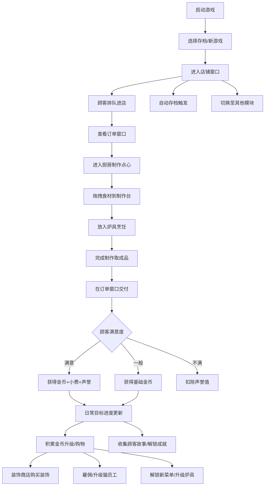

## 1. 产品概述
猫咪点心店是一款轻松治愈系经营模拟桌面游戏，玩家经营一家可爱的猫咪点心店，制作甜甜圈、奶茶和布丁，接待各式各样的猫咪顾客，收集金币升级店铺，解锁新菜单和装饰，与猫咪员工一起打造梦想中的点心店。

- 目标用户：喜欢轻松经营类游戏、收集要素、可爱猫咪风格的玩家
- 核心价值：治愈解压的经营体验，丰富的收集系统，渐进式的成长成就感

## 2. 核心功能

### 2.1 功能模块
1. **店铺窗口**：主营业界面，展示顾客座位、等待区、服务员、金币/声誉等状态栏
2. **厨房窗口**：拖拽食材制作甜甜圈、奶茶、布丁，料理进度条，炉具升级
3. **订单窗口**：当前订单队列，顾客需求展示，耐心条倒计时，外卖大单
4. **猫咪宿舍**：雇佣猫员工，安排休息/工作，员工技能升级，疲劳值管理
5. **装饰商店**：购买桌椅、壁纸、地板、装饰物，实时预览
6. **图鉴成就**：顾客故事收集，营业统计数据，成就贴纸解锁
7. **存档设置**：本地多存档管理，自动存档，难度切换（轻松/挑战）

### 2.2 页面详情
| 页面/模块 | 子模块 | 功能描述 |
|-----------|--------|----------|
| 店铺窗口 | 顾客区 | 显示排队猫客、就座顾客、耐心条、对话气泡 |
| 店铺窗口 | 状态栏 | 实时显示金币、声誉值、营业时间、日期 |
| 店铺窗口 | 员工区 | 显示工作中的猫员工、动画效果 |
| 厨房窗口 | 食材架 | 可拖拽的食材：面粉、糖、鸡蛋、奶油、茶包、水果、巧克力等 |
| 厨房窗口 | 制作台 | 拖放食材合成区域，显示制作步骤和进度 |
| 厨房窗口 | 炉具区 | 烤箱/煮锅/冰箱，可升级提速，料理动画 |
| 厨房窗口 | 成品架 | 制作完成的点心展示，可拖出交付 |
| 订单窗口 | 订单列表 | 显示每个顾客的详细需求、耐心条、小费概率 |
| 订单窗口 | 外卖大单 | 随机触发的大额订单，限时完成奖励丰厚 |
| 订单窗口 | 日常目标 | 每日任务列表，完成获得额外奖励 |
| 猫咪宿舍 | 员工列表 | 所有猫员工卡片，显示状态和属性 |
| 猫咪宿舍 | 员工详情 | 技能树、经验值、装备槽 |
| 猫咪宿舍 | 排班系统 | 安排工作/休息，疲劳值监控 |
| 装饰商店 | 分类目录 | 桌椅/壁纸/地板/装饰/音乐分类浏览 |
| 装饰商店 | 预览效果 | 点击装饰实时预览店铺效果 |
| 图鉴成就 | 顾客图鉴 | 已解锁顾客的故事、喜好、到访次数 |
| 图鉴成就 | 营业统计 | 总收入、总客流、热门商品等数据 |
| 图鉴成就 | 成就墙 | 成就贴纸收集展示，解锁条件说明 |
| 存档设置 | 存档管理 | 3个存档槽位，存档时间显示 |
| 存档设置 | 游戏设置 | 音量、难度切换、自动存档开关 |
| 存档设置 | 帮助说明 | 游戏操作教程 |

## 3. 核心流程

## 4. 用户界面设计

### 4.1 设计风格
- **主色调**：温暖奶油米色 (#FFF5E6) 为主背景，樱花粉 (#FFB6C1) 和抹茶绿 (#B7D8A8) 为双强调色，深巧克力棕 (#6B4423) 为文字和边框
- **次色调**：淡薰衣草紫 (#E6E6FA)、蜂蜜黄 (#FFE066)、草莓红 (#FF6B9D) 用于点缀
- **按钮风格**：圆角胶囊按钮，带轻微3D立体阴影，悬停上浮+发光效果，按下凹陷
- **字体**：中文使用圆润可爱的手写体风格 (ZCOOL KuaiLe / 站酷快乐体)，数字使用等宽圆润字体
- **布局风格**：卡片式布局，模块间有柔和阴影分隔，整体呈温暖小屋风格
- **图标风格**：手绘可爱风 emoji 图标，配合 lucide-react 线性图标
- **背景纹理**：细腻的纸张纹理 + 微弱的圆点波点图案

### 4.2 页面设计概述
| 页面/模块 | 设计元素 |
|-----------|----------|
| 店铺窗口 | 大场景插画背景，顾客动画行走，木质柜台，悬挂菜单板，柔和暖光动画，飘动的樱花粒子 |
| 厨房窗口 | 瓷砖台面，不锈钢炉具，食材悬浮卡片，拖拽时半透明跟随，烹饪蒸汽粒子效果 |
| 订单窗口 | 便签纸风格订单卡，倾斜角度随机，耐心条渐变颜色（绿→黄→红），完成时弹跳动画 |
| 猫咪宿舍 | 小床、猫爬架背景，员工卡片带轻微呼吸动画，升级时闪光粒子特效 |
| 装饰商店 | 木质货架风格，商品卡悬停放大，购买成功金币飞溅动画 |
| 图鉴成就 | 相册式布局，翻页效果，未解锁内容模糊处理带问号，成就贴纸金边发光 |
| 存档设置 | 书本风格卡片，存档缩略图，开关按钮滑动动画 |

### 4.3 响应式
- 桌面优先设计，主窗口固定 1280x800 游戏画布
- 支持全屏模式和窗口化切换
- 内部模块使用弹性布局适应不同分辨率
- 拖拽操作针对鼠标优化，同时保留点击备选操作

### 4.4 视觉特效
- 粒子系统：金币飞溅、蒸汽、樱花、星星
- 过渡动画：模块切换淡入淡出+缩放
- 微交互：按钮按压、卡片悬停、拖拽幽灵
- 进度动画：烹饪进度条脉冲、耐心条闪烁警告
- 成就通知：右上角滑入弹窗，带音效提示
