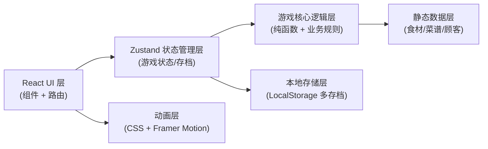
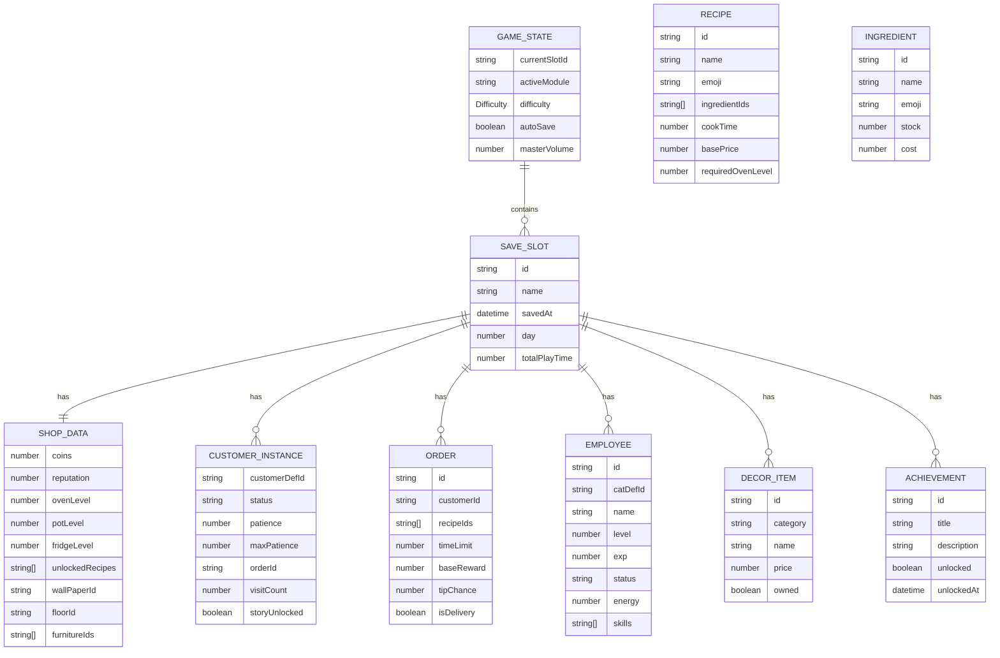

## 1. 架构设计



## 2. 技术描述

- **前端框架**：React@18 + TypeScript
- **构建工具**：Vite@5
- **样式方案**：TailwindCSS@3 + 自定义设计 tokens
- **状态管理**：Zustand（轻量级，支持持久化中间件）
- **路由方案**：React Router DOM@6（标签页式模块切换）
- **动画库**：Framer Motion（拖拽、过渡、粒子效果）
- **图标库**：Lucide React（功能性图标）+ Emoji（游戏元素图标）
- **本地存储**：localStorage API + 自定义存档序列化
- **后端**：无需后端，纯前端本地游戏
- **数据库**：无，所有数据静态 JSON + localStorage 持久化

## 3. 路由与模块定义

采用单页应用 + 标签切换模式，主路由为 `/`，通过 Zustand 状态控制当前激活模块。

| 模块标识 | 组件路径 | 功能说明 |
|----------|----------|----------|
| SHOP | `src/modules/shop/ShopModule.tsx` | 店铺主窗口 |
| KITCHEN | `src/modules/kitchen/KitchenModule.tsx` | 厨房制作窗口 |
| ORDERS | `src/modules/orders/OrdersModule.tsx` | 订单管理窗口 |
| DORMITORY | `src/modules/dormitory/DormitoryModule.tsx` | 猫咪宿舍 |
| DECOR | `src/modules/decor/DecorModule.tsx` | 装饰商店 |
| COLLECTION | `src/modules/collection/CollectionModule.tsx` | 图鉴成就 |
| SETTINGS | `src/modules/settings/SettingsModule.tsx` | 存档设置 |

## 4. 核心数据模型



## 5. 状态管理设计

### 5.1 Zustand Store 切片

```typescript
// src/store/useGameStore.ts
interface GameStore {
  // 存档管理
  slots: SaveSlot[]
  currentSlotId: string | null
  saveGame: () => void
  loadGame: (slotId: string) => void
  createNewSlot: (name: string) => void
  deleteSlot: (slotId: string) => void
  
  // 游戏设置
  settings: GameSettings
  updateSettings: (patch: Partial<GameSettings>) => void
  
  // 核心经济
  coins: number
  reputation: number
  day: number
  addCoins: (amount: number) => void
  spendCoins: (amount: number) => boolean
  
  // 订单系统
  orders: Order[]
  customers: CustomerInstance[]
  spawnCustomer: () => void
  deliverOrder: (orderId: string, recipeIds: string[]) => void
  cancelOrder: (orderId: string) => void
  
  // 厨房系统
  inventory: Record<string, number>
  cookingSlots: CookingSlot[]
  preparedItems: PreparedItem[]
  startCooking: (recipeId: string, slotIndex: number) => void
  collectCooked: (slotIndex: number) => void
  useIngredients: (ingredientIds: string[]) => boolean
  
  // 员工系统
  employees: Employee[]
  hireEmployee: (catDefId: string) => boolean
  setEmployeeStatus: (empId: string, status: 'working' | 'resting') => void
  
  // 装饰系统
  ownedDecor: string[]
  activeDecor: ActiveDecor
  buyDecor: (decorId: string) => boolean
  applyDecor: (decorId: string) => void
  
  // 图鉴成就
  unlockedStories: string[]
  achievements: Achievement[]
  statistics: Statistics
  unlockAchievement: (achievementId: string) => void
}
```

### 5.2 游戏循环与计时器

使用 `useGameLoop` 自定义 Hook，基于 `requestAnimationFrame` 或固定时间间隔 (500ms) 更新：
- 顾客耐心条递减
- 烹饪进度条递增
- 员工疲劳值变化
- 自动存档触发
- 随机事件触发

## 6. 目录结构

```
src/
├── main.tsx
├── App.tsx
├── index.css
├── assets/
│   └── (静态图片资源，如无则使用emoji)
├── components/
│   ├── layout/
│   │   ├── GameShell.tsx
│   │   ├── NavBar.tsx
│   │   ├── StatusBar.tsx
│   │   └── Modal.tsx
│   ├── ui/
│   │   ├── Button.tsx
│   │   ├── Card.tsx
│   │   ├── ProgressBar.tsx
│   │   └── Particle.tsx
│   └── common/
│       ├── CoinDisplay.tsx
│       ├── CustomerCard.tsx
│       └── CatAvatar.tsx
├── modules/
│   ├── shop/
│   ├── kitchen/
│   ├── orders/
│   ├── dormitory/
│   ├── decor/
│   ├── collection/
│   └── settings/
├── store/
│   ├── useGameStore.ts
│   └── persist.ts
├── data/
│   ├── recipes.ts
│   ├── ingredients.ts
│   ├── customers.ts
│   ├── employees.ts
│   ├── decor.ts
│   └── achievements.ts
├── logic/
│   ├── cooking.ts
│   ├── economy.ts
│   ├── customers.ts
│   └── achievements.ts
├── hooks/
│   ├── useGameLoop.ts
│   ├── useDraggable.ts
│   └── useParticleEffect.ts
├── types/
│   └── index.ts
└── utils/
    ├── storage.ts
    ├── random.ts
    └── format.ts
```

## 7. 存档序列化方案

- 每个存档槽位独立存储 key: `cat-cafe-slot-{id}`
- 版本号字段确保数据兼容性升级
- 自动存档间隔：60秒 + 关键操作触发（完成订单、购买等）
- 最大槽位数：3 + 1个云备份占位（本地保留）
- 数据格式：压缩 JSON，包含版本号、时间戳、游戏状态快照
